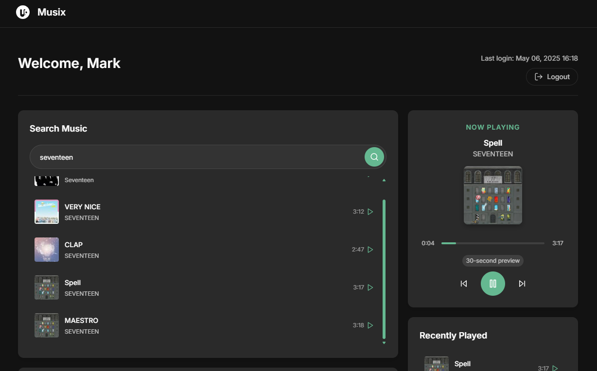

# Musix

A modern web-based music streaming application built with Laravel and JavaScript.



## Features

- 🎵 Search and stream music from a vast library
- 🔐 Secure user authentication system
- 🎧 Custom audio player with playback controls
- 📱 Fully responsive design for all devices
- 📊 Track listening history and recently played songs

## Tech Stack

- **Backend**: Laravel 12
- **Frontend**: JavaScript, HTML5, CSS3
- **Authentication**: JWT (JSON Web Tokens)
- **API**: Deezer API via RapidAPI
- **Database**: MySQL

## Getting Started

### Prerequisites

- PHP >= 8.1
- Composer
- Node.js & NPM
- MySQL

### Installation

1. Clone the repository
```bash
git clone https://github.com/yourusername/musix.git
cd musix
```

2. Install dependencies
```bash
composer install
```

3. Configure environment variables
```bash
cp .env.example .env
# Edit .env file with your database and API credentials
```

4. Set up your RapidAPI credentials in the `.env` file
```
MUSIC_API_HEADER=deezerdevs-deezer.p.rapidapi.com
RAPID_API_KEY=your_rapid_api_key
```

5. Generate application key
```bash
php artisan key:generate
```

6. Run migrations
```bash
php artisan migrate
```

7. Start the development server
```bash
php artisan serve
```

8. Visit http://localhost:8000 in your browser

## Usage

### Authentication

- Register a new account or login with existing credentials
- Secure JWT authentication keeps your session active

### Music Discovery

- Browse trending tracks on the dashboard
- Search for songs, artists, or albums using the search bar
- Click on any track to play it

### Music Playback

- Full-featured audio player with play/pause controls
- Track progress bar with seek functionality 
- 30-second previews available for all tracks

### User Profile

- View your recently played tracks
- Logout securely when finished

## API Integration

The application uses the Deezer API through RapidAPI for fetching music data. API requests are proxied through Laravel controllers for security.

## Security

- All API keys are stored securely on the server side
- JWT tokens for authentication with proper expiration
- CSRF protection on all forms
- Input validation on all user inputs

## Browser Support

- Chrome (latest)
- Firefox (latest)
- Safari (latest)
- Edge (latest)

## Contributing

1. Fork the repository
2. Create your feature branch (`git checkout -b feature/amazing-feature`)
3. Commit your changes (`git commit -m 'Add some amazing feature'`)
4. Push to the branch (`git push origin feature/amazing-feature`)
5. Open a Pull Request

## License

This project is licensed under the MIT License - see the [LICENSE](LICENSE) file for details.

## Acknowledgements

- [Laravel](https://laravel.com/) - The web framework used
- [Deezer API](https://developers.deezer.com/api) - Music data provider
- [RapidAPI](https://rapidapi.com/) - API marketplace
- [Feather Icons](https://feathericons.com/) - Icons used in the UI

---

